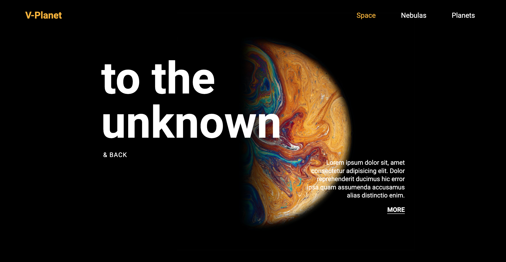
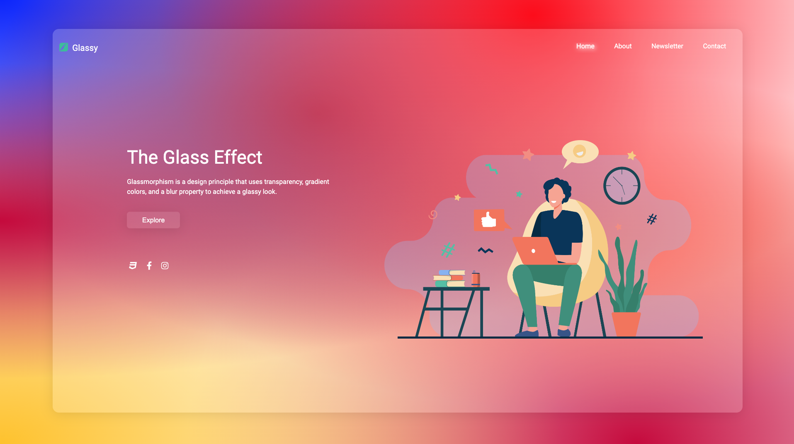
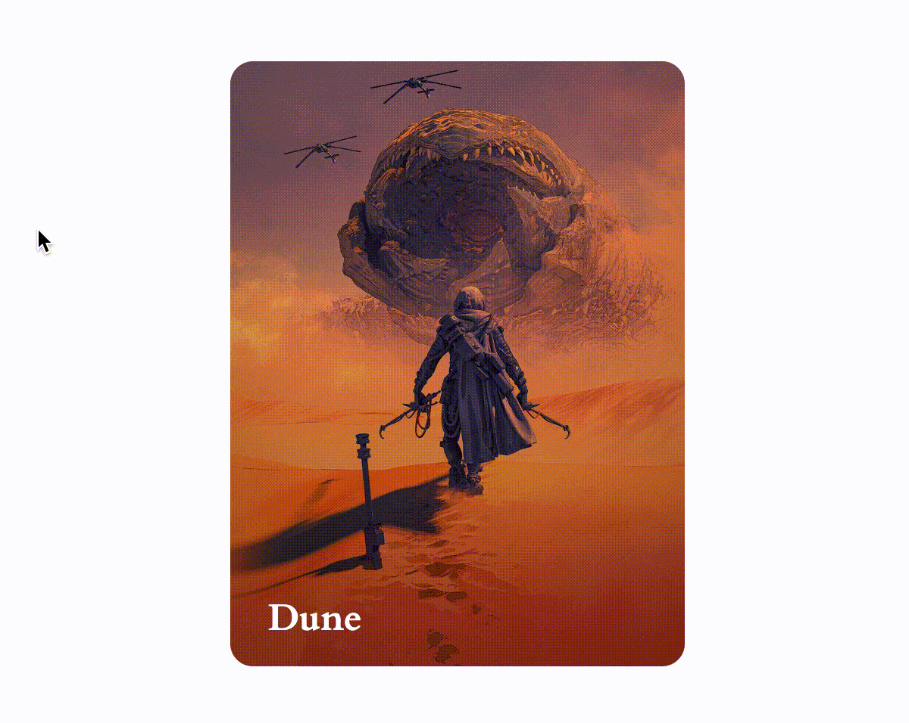

# CSS Projects

My deep dive into different CSS elements and designs

### Highlights

1. Responsive Design

     Live demo available at https://devjhom.github.io/responsive-design/




   Live demo available at https://devjhom.github.io/glass-effect/



2. Card Hover

     Live demo available at https://devjhom.github.io/dune-card-hover/



3. Sliding Text

     Live demo available at https://devjhom.github.io/sliding-texts/
     
4. And more projects in the repo...

## Getting Started
Clone this repository to your local machine.

1. To clone this repository
    ```sh
    git clone https://github.com/DevJhom/css-projects.git
    ```

2.  Run ```index.html``` of each project on your browser


Please feel free to share or use the source codes in your own personal projects.

<br>
Image attributions
<br>
https://unsplash.com/photos/gEta6dbzFy0
<br>
https://www.pinterest.com/pin/120612096258946466/
<br>
https://www.figma.com/file/GLVHdPJFS7hjP9u7XYeYWm/SALY---3D-Illustration-Pack-(Community)?node-id=7%3A4
